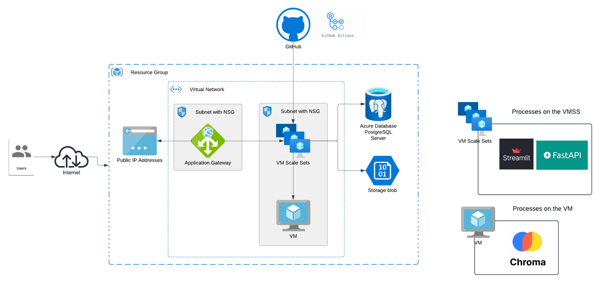

# Azure Infrastructure with Terraform - SDA Cloud Bootcamp Project



## 🚀 Overview

This project is part of a **Cloud Bootcamp** designed to help participants build real-world infrastructure on Microsoft Azure using Terraform. The architecture shown above represents a full deployment of a scalable and secure application environment, utilizing several Azure services.

## 🧱 What This Project Builds

- **Virtual Network** with two subnets:
  - One for the Application Gateway
  - One for compute resources (VM and VM Scale Set)
- **Network Security Groups (NSG)** to control traffic
- **Application Gateway** to route internet traffic to internal services
- **Virtual Machine Scale Set (VMSS)** running:
  - `Streamlit`
  - `FastAPI`
- **Virtual Machine (VM)** running:
  - `Chroma` service
- **PostgreSQL** (Azure Database for PostgreSQL)
- **Azure Storage Account** with blob containers
- **Public IP Address** to expose the Application Gateway

## 📂 File Structure

terraform/ 
│ 
├── main.tf   # Core Terraform resources 
├── variables.tf   # Input variables - edit this! 
├── outputs.tf   # Outputs after apply 
├── network.tf   # Networking setup (VNet, Subnets) 
├── vmss.tf  # Virtual Machine Scale Set (VMSS) for Streamlit & FastAPI 
├── vm.tf  # Standalone VM for Chroma
├── application_gateway.tf  # App Gateway and routing rules 
├── postgres_DB.tf   # PostgreSQL server 
├── storage.tf   # Storage account 
├── terraform.tfvars # File where user provides actual values for variables 
├── terraform.tfstate # Terraform state file (auto-generated after apply)
└── README.md  # You're here!


## 🧑‍💻 Getting Started

1. **Clone the repo**
   ```bash
   git clone <the-repo-url>
   cd terraform-project
   touch terraform.tfvars
   ```

2. **🔐 Generate SSH Key**
  To generate an SSH key named `id_rsa`, run the following command in your terminal:
  ```bash
  ssh-keygen -t rsa -b 4096 -f ~/.ssh/id_rsa
  ```

3. **Edit the variables**
   Open `variables.tf` and update:
   - Resource group name
   - Region
   - Custom ports
   - Database credentials
   - Storage Accoount & Container name

4. **Initialize Terraform**
   ```bash
   terraform init
   ```

5. **Preview changes**
   ```bash
   terraform plan
   ```

6. **Apply the infrastructure**
   ```bash
   terraform apply
   ```

## 💡 Notes

- The Application Gateway handles routing to the VMSS backend.
- VMSS scales automatically and hosts your API and UI services.
- A standalone VM runs additional services like `Chroma`.
- PostgreSQL and Storage Account are used for data persistence.
- GitHub Actions (optional) can be used for CI/CD with your repo.

## 📝 Requirements

- Terraform ≥ 1.5
- Azure CLI logged in
- SSH key pair
- Azure subscription with sufficient permissions

---


## 🔧 Setup

**IN VMSS**

1. Clone this repository inside VMSS:
   ```bash
   git clone https://github.com/tahani24/SDA-cloude-project.git
   cd SDA-cloude-project


**IN VM**

2. Install Chroma 
 


All you need to do is edit `variables.tfvars` to suit your environment, and Terraform takes care of the rest! 🎯
